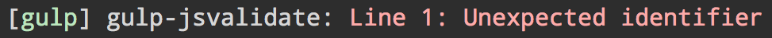

# gulp-jsvalidate [](https://travis-ci.org/sindresorhus/gulp-jsvalidate)

> Validate JavaScript code and report possible syntax errors



The earlier you find syntax errors, the earlier you can fix them.


## Install

```
$ npm install --save-dev gulp-jsvalidate
```


## Usage

```js
const gulp = require('gulp');
const jsValidate = require('gulp-jsvalidate');

gulp.task('default', () =>
	gulp.src('app.js')
		.pipe(jsValidate())
);
```


## License

MIT © [Sindre Sorhus](https://sindresorhus.com)
